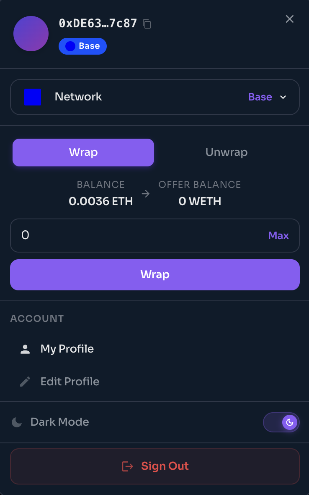

# How to Sell an NFT on PrimePort

### Before You Start

* Your wallet connected to PrimePort on the correct network
* The NFT you want to sell in your wallet (not locked or staked elsewhere)
* A small amount of native gas token (XDC or ETH) to sign the listing transaction

***

### Step 1. Go to Your Profile

Click your wallet address or the **Profile** icon in the top-right corner and select **My Profile**. Your wallet's NFTs will appear here.

<figure><figcaption></figcaption></figure>

***

### Step 2. Open the NFT and Click Sell

Click the NFT you want to list. On the detail page, click the **Sell** button.

***

### Step 3. Configure Your Listing

Fill in the listing details:

* **Currency.** Select the currency for the sale (XDC on XDC Network, ETH on Base)
* **Price.** Enter your asking price
* **Expiry date.** Set when the listing should expire

<figure><figcaption></figcaption></figure>

Check the **I agree to the Terms of Service** box and click **List Item**.

***

### Step 4.  Confirm the Transaction

Your wallet will prompt you to approve the listing transaction. Confirm it. A second signature request may appear, sign it to finalize the listing.

Once confirmed, your NFT will appear as **For Sale** on the collection page and in marketplace search results.

***

### Step 5.  Managing Your Listing

To update or cancel a listing, go to **My Profile**, open the NFT, and select **Cancel Listing**. Cancelling requires a small gas transaction.

If a buyer submits an **offer** below your asking price, you will see it on the NFT detail page. You can accept or ignore it, accepting triggers an on-chain transfer and the proceeds go directly to your wallet.

***

### Fee Breakdown

When your NFT sells, the following fees are deducted from the sale price:

| Fee                | Amount         | Recipient                                 |
| ------------------ | -------------- | ----------------------------------------- |
| Marketplace fee    | 0.25%          | PRFI ONFT holders                         |
| Collection royalty | set by creator | 50% to PRFI ONFT holders · 50% to creator |

The amount you receive = sale price minus marketplace fee minus royalty.

***

### See Also

* How to Buy an NFT
* Using the Auction System
* Getting Started. Wallet setup and network configuration
