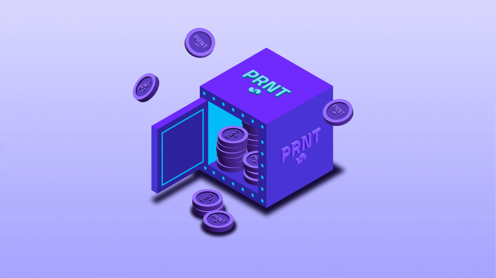

# Prime Numbers Staking NFTs Explained

<figure><figcaption></figcaption></figure>

In this section, we explain the mechanics behind the revolutionary Prime Numbers Staking NFTs.&#x20;

### <mark style="color:purple;">**What are staking NFTs?**</mark>

The Prime Numbers staking NFTs are like vaults or piggy banks. By purchasing one of these NFTs you can stake certain crypto tokens inside of it. Each NFT has 20 levels, the more you level it up, the more you receive from the rewards pool. Each level requires a certain number of tokens to reach the next level. Levelling up your NFT increases the multiplier which means you get a bigger share of the rewards. Each NFT has a different base multiplier depending on its rarity.

### <mark style="color:purple;">**What are the rarities of the NFTs?**</mark>

Each staking NFT has a different rarity. The higher the rarity of the NFT the higher the base multiplier for that NFT. Your base multiplier along with your added multiplier equals your total multiplier which determines how much your share of the rewards pool is each month. Your added multiplier comes from the levels inside the NFT. Each level you complete adds 0.1 to your added multiplier so by reaching the max level of 20 your added multiplier will be maxed out at 2.0 which then gets added to your base multiplier to give the NFT its total multiplier.

### <mark style="color:purple;">**Where can I buy these NFTs?**</mark>

Currently, there are two types of NFTs available on the PrimePort marketplace. We have the PRNT Staking NFTs which you can stake PRNT tokens inside of and the XDC Staking NFTs where you can stake your XDC inside of it. Both NFTs have 20 levels inside the NFT to complete.

### <mark style="color:purple;">**How do I stake?**</mark>

Connect the wallet containing your NFTs to the Prime Numbers staking website and then you'll be able to access the staking interfaces for each type of NFT. The Prime Numbers staking website is [https://staking.primenumbers.xyz/](https://staking.primenumbers.xyz/)

### <mark style="color:purple;">**When do I receive the rewards?**</mark>

Rewards for both the PRNT and XDC Staking NFTs get paid out on the last day of each calendar month. The XDC masternode rewards also get paid out on the last day of each month.&#x20;

### <mark style="color:purple;">**Where do I receive the rewards?**</mark>

When you claim your rewards all the rewards get added to your NFT.

### <mark style="color:purple;">**How do I collect my rewards?**</mark>

Once the rewards have been sent at the end of each month you need to go and claim those rewards. Simply connect your wallet to the staking website, go to your NFT and press the claim rewards button.

For the XDC Staking NFTs, go to your NFT and press the Claim XDC button. Once the transaction completes the rewards will be added to your NFT. Click [here](https://medium.com/@PrimeNumbersFi/claiming-your-xdc-rewards-cc37d94f6ace) to read our guide about claiming your XDC rewards or [here](https://youtu.be/ZXRXU1gvHNg) to watch our video tutorial.

For the PRNT Staking NFTs, go to your NFT and press the Claim PRNT button. Once the transaction completes the rewards will be added to your NFT. Click [here](https://medium.com/@PrimeNumbersFi/how-to-claim-your-prnt-staking-nft-rewards-cf7d7e33e47b) to read our guide about claiming your PRNT rewards or [here](https://youtu.be/OdvkTKwJYbg) to watch our video tutorial. The rewards get paid into the NFT and contribute to it reaching the next level. Once your NFT is at the max level of 20 then the **'Get Surplus'** button becomes available and you can withdraw all your surplus rewards each month.

The PRNT Staking NFTs are known as vaults or piggy banks because if you want your PRNT tokens back before the NFT reaches max level then you have to break open the NFT which destroys it and the tokens then get transferred back into your wallet. This is why the NFTs are so valuable because the NFT supply is deflationary.

### <mark style="color:purple;">**Where do the rewards come from?**</mark>

For the PRNT Staking NFTs, there's a rewards pool that was created in May 2022 and it will last for six years. The PRNT NFT holders get a share of the 20,000 PRNT tokens paid out each month. The royalties on resales of these NFTs are set at 10%.  Half of those royalties (5%) get paid out to PRNT NFT holders at the end of each month. The PrimePort marketplace fee is 1.5% and 0.25% of all NFT sales is sent back to PRNT NFT holders as rewards. The main source of rewards will come from Prime Numbers Finance once that is fully up and running. PRNT NFT holders get 40% of the Prime Numbers Finance profits each month.

For the XDC Staking NFTs, there's a rewards pool that was created in April 2023 and it will last for two years. 30% of the minting funds from this collection were placed into the rewards pool and 82,000 XDC gets paid back to the XDC Staking NFT holders at the end of each calendar month. However, the main source of rewards will come from Prime Numbers Finance and when it's fully up and running the XDC NFT holders will get 10% of the Prime Numbers Finance profits per month.

Also, if you locked your NFT up in the Prime Numbers XDC Masternode then you get 7% in rewards per year. These rewards get paid into your NFT at the end of each month at the same time as the staking rewards.

### <mark style="color:purple;">**What other features do the staking NFTs have?**</mark>

The XDC Staking NFTs include a feature where you can merge two NFTs of the same rarity together to make one NFT of a higher rarity.

### <mark style="color:purple;">**Conclusion...**</mark>

All in all our staking NFTs are revolutionary. NFTs are a great way to stake your crypto and earn a passive income. With the supplies being deflationary these NFTs will increase in value over time as fewer NFTs will exist.
