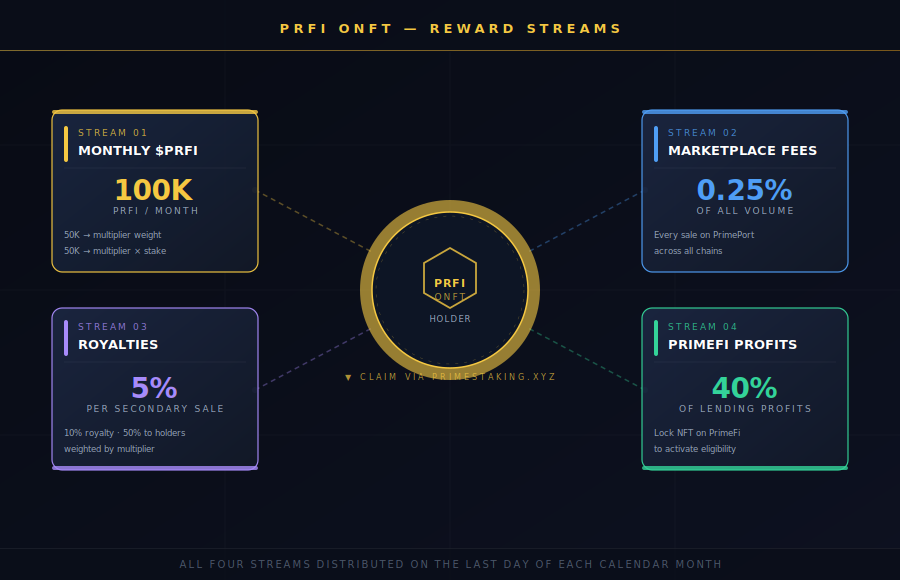

# Rewards

PRFI ONFT holders earn from multiple sources. Rewards accumulate automatically and can be claimed through the staking platform.

***

## Reward Sources


<figure><figcaption></figcaption></figure>

### 1. Monthly $PRFI Rewards

**100,000 $PRFI** is distributed monthly across all staked PRFI ONFTs. Rewards are split into two equal portions:

* **Part 1 (50,000 PRFI)** — Based on your **total multiplier** relative to all other NFTs
* **Part 2 (50,000 PRFI)** — Based on your **multiplier × staked amount** relative to all other NFTs

```
Part 1 = (Your Total Multiplier / Sum of All Multipliers) × 50,000 PRFI
Part 2 = (Your Multiplier × Your Stake / Sum of All Multiplier×Stake) × 50,000 PRFI
Total  = Part 1 + Part 2
```

This dual approach ensures that both NFT quality (rarity and level) and staking commitment are rewarded. A high-rarity NFT with a large stake earns the most.

### 2. PrimePort Fee Sharing

**0.25%** of all PrimePort marketplace transaction volume is distributed to PRFI ONFT holders. Every time an NFT is sold on PrimePort, on any chain, stakers benefit.

### 3. Royalties from Secondary Sales

NFT holders receive **50%** of all PrimePort marketplace royalties on secondary sales. The royalty rate is 10%, meaning **5% of each sale price** is distributed to all PRFI ONFT holders, weighted by multiplier.

### 4. PrimeFi Profit Sharing (soon)

**40%** of [PrimeFi](https://app.primefi.xyz) lending and borrowing protocol profits are distributed to PRFI ONFT holders. To be eligible for PrimeFi rewards, you need to **lock your NFT on PrimeFi** for a specified period.

***

## Reward Frequency

| Source                   | Frequency |
| ------------------------ | --------- |
| Monthly PRFI pool        | Monthly   |
| PrimePort fee sharing    | Monthly   |
| Secondary sale royalties | Monthly   |
| PrimeFi profits          | Monthly   |

Rewards are distributed on the **last day of each calendar month**.

***

## How to Claim

1. Go to [primestaking.xyz](https://primestaking.xyz)
2. Connect your wallet
3. Navigate to your PRFI ONFT
4. Click **Claim Rewards**
5. Confirm the transaction in your wallet

Claimed rewards are added to the staked balance inside your NFT, helping you level up faster. Once your NFT reaches **max level (20)**, surplus rewards can be withdrawn directly to your wallet.

***

## Viewing Rewards on PrimePort

On PrimePort, the **Staking** tab on any PRFI ONFT detail page shows the current staking state, including total PRFI staked and level progress. Reward claim history is tracked on-chain and can be viewed via the [BaseScan explorer](https://basescan.org/address/0x693a3a45ff596024f844be1cc6845d59f778dcf5).

***

## See Also

* [**Staking Mechanics**](staking-mechanics.md) — Levels, daily limits, and how staking works
* [**Rarity & Multipliers**](rarity-and-multipliers.md) — How rarity determines your base multiplier
* [**Reward System (Prime Staking Docs)**](https://docs.primestaking.xyz/products/prfi-staking-nfts/prfi-nft-staking-reward-system) — Detailed reward system documentation
